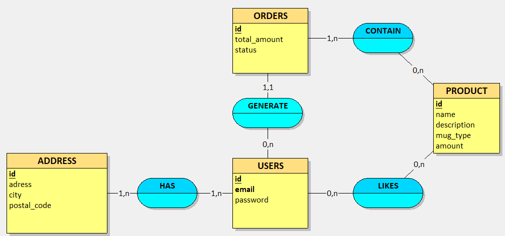

# CORRECTION MCD

## Nom des entités :
- USER est un mot clé réservé en SQL
- ORDER est un mot clé réservé en SQL

## id / clé primaire

- doivent être souligné

## Associations

- Doivent êtres représenter par des ellipses ou des losanges.
- LIKE est un mot clé réservé en SQL

## Cardinalités

### USERS/ADDRESS

- on considère qu'un utilisateur doit avoir au moins 1 adresse pour pouvoir passer commande : 1,N
- une addresse peut appartenir à au moins 1 personne ou plusieurs (il peut y avoir plusieurs clients de la même famille qui habite la même adresse) : 1,N

### USERS/PRODUCT

- un utilisateur peut ne pas liker un produit ou liker plusieurs produits : 0,N
- un produit peut ne pas être liké par un utilisateurs ou liké par plusieurs utilisateurs : 0,N

Tout le reste est ok 👍

Pour réalisser tes schémas, tu peux utiliser le logiciel gratuit et libre d'utilisation de MCD Looping (https://www.looping-mcd.fr/)
